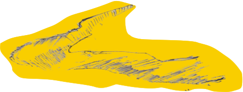

  

      साये कहाँ थे राह में, जो बैठते मदन ;  
      तय किए हमने सफ़र , बड़ी सख़्तियों के साथ ।
  

    

  

  फ़िक्रों फ़न के मुँहज़ोर परिंदो बोलो ;  
  इंसा में तो अब ताकते-गुफ़्तार नहीं ।  
    
    
  

   

Madan Maholvi

1936 - 2005

&copy; 2022

  

      <a href="https://poems.shutri.com/how.html">Navigation ? </a>
  

